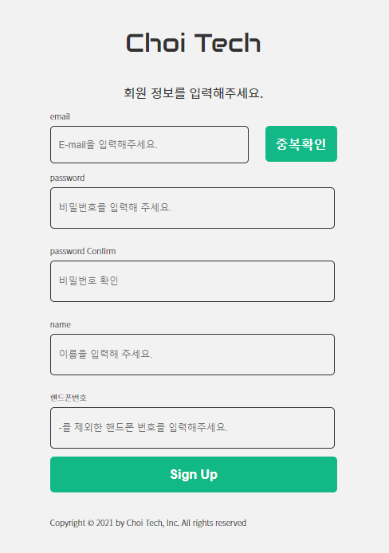

# 프로젝트 소개

이 프로젝트는, 개발하면서 얻은 지식 또는 기술 등을 공유를 하고, 댓글 등을 통하여 서로 질의 응답을 통해 개발자들끼리 양질의 지식을 얻기 위한 블로그 입니다.

---
## 왜 이 프로젝트를 만들었을까?

큰 이유는 없습니다. 개인적으로 외부로 부터 얻은 정보들을 꾸준히 기록하고, 공유를 해야 겠다는 생각이 들었습니다.

현재 다양한 블로그 기능을 제공하는 서비스가 많습니다. 예를 들면, 티스토리, Medium, Velog 등등..

저는 해당 블로그에도 작성을 하고, 티스토리에도 기록을 하고 있는 와중에, 문득 블로그 기능들이 어떻게 이루어 졌는지 궁금증에 직접 만들어 보게 되었습니다.

---

## 배포 주소

URL: https://c-tech.vercel.app

---

## 프로젝트 환경

### Back-end

- Language & Library: Javascript, Node.js (Express)
- DB: Mysql
- infra: heroku (배포)

백엔드 프로젝트는, 데이터베이스 등 개인 정보 등의 이유로 인하여 코드를 공개 하지 않았습니다.

### Front-end

- Language & Library: Typescript, React (Next.js)
- State: Mobx
- Design: Styled-Components, material-ui, React-modal
- Editor: toast-ui editor, prism, highlight.js
- ETC: React-hook-form, Babel, EsLint, Prettier 등
- infra: Vercel (배포)

---

## 화면 구성

### 1. 메인 화면

> URL : https://c-tech.vercel.app

### 설명

메인 화면에는, 최근에 등록된 게시글에 대해서 3개가 보이도록 구성 되어 있습니다.

또한, 하단에 더보기 버튼을 클릭 했을 경우에, 블로그 링크로 이동 되어, 모든 게시글을 볼 수 있습니다.

### 2. 로그인

> URL : https://c-tech.vercel.app/login

### 설명

이미지와 같이 이메일 및 패스워드를 입력하여, 로그인을 할 수 있습니다. 로그인을 성공하면, 백엔드에서 Response 값으로 JWT Token 값을 전달 해 주는데, 해당 토큰은 쿠키에 저장됩니다.

또한, 해당 페이지에서는, 비밀번호 찾기(Modal) 또는 회원가입 (라우팅)이 되도록 추가되어 있습니다.

비밀번호 찾기는, 앞서 설명과 같이 모달로 동작하도록 구현 되어 있으며, 이메일 유효성 검사 및, 백엔드 쪽에서 인증번호를 생성해서, 등록된 메일로 메일 전송 그리고 인증번호가 일치 할 때 비밀번호를 변경하도록 구현 되어 있습니다.

### 3. 회원가입

> URL : https://c-tech.vercel.app/join

### 설명

회원가입 화면에서는 이메일 형식에 맞게 정규식과 중복 확인을 통한 유효성 검사가 수행 됩니다.

이메일 뿐만 아니라, 특수문자를 포함한 패스워드를 입력하도록 정규식이 구현 되어있습니다.

### 4. 블로그 리스트

> URL: https://c-tech.vercel.app/blog?page=1

### 설명

해당 화면은, 이용자 (개발자 등)들이 등록한 게시글 리스트들을 볼 수 있는 화면 입니다.

주요 기능은, 검색 및 페이지네이션 처리가 되어 있습니다.

#### 추가 기능들

1 ) 페이징

2 ) 글쓴이 메뉴 (특정 글쓴이가 쓴 게시글만 보도록 라우팅 하거나, 메세지를 보낼 수 있는 메뉴)

### 5. 블로그 등록

> URL: https://c-tech.vercel.app/blog/create

### 설명

로그인 후, 게시글을 등록 할 수 있는 화면 입니다.

제목, 요약, 내용, 타입을 입력 할 수 있으며, 내용을 입력하는 부분은 Toast-ui editor library를 사용하여, 마크다운으로 입력 하면, 우측에 html 형식으로 확인 할 수 있습니다.

### 6. 블로그 수정

> URL: https://c-tech.vercel.app/blog/update?blog_id=10

### 설명

화면 구성은 블로그 등록과 동일하게 되어 있습니다.
api 요청은, request header부분에 토큰값을 함께 전달 하여, 서버 쪽에서, 토큰을 검증한 후 본인의 계정일 경우에만 수정 되도록 구현 되어있습니다.

### 7. 블로그 상세

> URL: https://c-tech.vercel.app/blog/1/[id]

### 설명

작성자가 작성한 게시글에 대해 상세 화면으로 진입 합니다.
content는 html 형식으로 된 텍스트로 저장되어 있어, html-react-parser library를 사용하여, 해당 콘텐츠를 텍스트를 html 형식으로 전환 시킵니다.

또한 Prism library를 사용하여, 코드를 block 형식으로 보이도록 구현 되었습니다.

로그인하여 본인의 게시글에 접근 하였을 때, 수정 또는 블로그 숨김 기능을 동작 시킬 수 있습니다.
블로그 숨김기능을 사용하면, 블로그 리스트에서는 볼 수 없습니다. 하지만 마이페이지에서는 숨김 처리된 블로그를 확인 할 수 있으며, 숨김 해제를 통해서 다시 블로그 리스트에 노출 시킬 수 있습니다.

### 8. CONTACT

> URL: https://c-tech.vercel.app/contact?receiver=${user_id}

### 설명

HEADER 부분에 CONTACT 메뉴 또는 블로그 화면에서 작성자에 마우스 HOVER 하여 나오는 메뉴에 메세지 전송을 통해 나타나는 화면 입니다.

HEADER부분으로 CONTACT 화면에 접근 시, url에 받는사람에 대한 id가 없습니다. ex) https://c-tech.vercel.app/contact

receiver가 없는 경우에는, 관리자에게 메세지가 전송됩니다.

블로그 작성자에서 메세지 전송을 통해 CONTACT 화면에 접근 시, receiver이 있습니다. ex) https://c-tech.vercel.app/contact?receiver=1

receiver가 있는 경우에는, receiver에 해당하는 user에게 메세지가 전송 됩니다.

추가로, 메세지 입력하는 INPUT 영역은 필수 값이며, 만약에 로그인이 되어있는 경우라면, 메세지를 제외한 이름, 이메일, 전화번호가 자동으로 입력됩니다.

### 9. 마이페이지 - 내가쓴 글 보기

> URL: https://c-tech.vercel.app/mypage/[user_id]/blogs

### 설명

로그인 후, 헤더 부분 우측에 위치한 user_name을 클릭하면 마이페이지에 접근 할 수 있습니다.

마이페이지에 종류는 3가지가 있는데, 내가 쓴 글 보기가 기본 라우팅 경로로 설정 되어 있습니다.

블로그 리스트와 비슷한 구조로 되어 있지만, 조금 다른점은, 숨김된 게시글을 확인 할 수 있으며, 숨김된 게시글은, Title 앞부분에 [숨김] 으로 표시 되어 있습니다.

또한, 작성자에 마우스 Hover시, 숨김 또는 숨김해제 기능과 게시글 삭제 기능이 추가 되어 있습니다.

게시글 삭제를 했을 경우는 완전히 삭제가 되므로, 마이페이지에서도 게시글을 확인할 수 없습니다.

### 10. 마이페이지 - 전달받은 메세지

> URL: https://c-tech.vercel.app/mypage/[user_id]/contact

### 설명

해당 화면은, contact 화면으로 부터 작성되어 전달받은 메세지를 확인 할 수 있는 화면 입니다.

보기를 눌렀을 경우에는, react-modal library를 사용하여, 모달을 띄어 전달받은 메세지를 다음과 같이 상세히 볼 수 있습니다.

### 11. 마이페이지 - 정보 변경

> URL: https://c-tech.vercel.app/mypage/[user_id]/settings

### 설명

정보 변경하는 화면 입니다.
정보를 변경하기 전, 비밀번호를 입력하여, 본인 계정이 맞는지 검증을 먼저 진행합니다.

비밀번호가 일치 할 경우에는 다음과 같은 화면이 나타납니다.

해당 화면에서, 회원 가입 했을 때 입력한 개인 정보 (이메일, 이름, 전화번호가) 나타 나며, 이메일은 변경할 수 없으므로 readOnly로 되어있습니다.

이름 및 전화번호를 수정한 후, [정보 변경] 버튼을 누르면 정보가 변경 됩니다.

그리고, 정보 변경 버튼 왼쪽에 위치한 비밀번호 변경을 클릭하면 다음과 같은 모달이 나타납니다.

비밀번호 변경 모달에서는, 회원가입과 동일하게 특수문자를 포함한 정규식을 검사 하며, 비밀번호와 비밀번호 확인이 일치 했을 경우에 변경을 수행 합니다.

### 12. 마이페이지 - 블로그 카테고리 설정

> URL: https://c-tech.vercel.app/mypage/[user_id]/categories

### 설명

마지막으로 이 화면은, 블로그 등록 및 수정 시, 카테고리를 설정하는 화면 입니다.

카테고리 CREATE 및 UPDATE는 동일한 카테고리 명으로는 CREATE 또는 UPDATE 동작을 하지 않습니다.

카테고리 삭제는, 해당 카테고리로 등록된 게시글이 0개일 때, 삭제가 가능합니다.
만약에, 해당 카테고리로 등록된 게시글이 1개 이상일 경우에는 삭제가 되지 않도록 disabled 처리가 되어 있습니다.

또한 카테고리명을 수정 했을 경우에는 해당 카테고리로 등록된 게시글에 대해, 카테고리명이 자동으로 변경 됩니다.

---

추가로 해당 프로젝트에 대한 궁금증 또는 문의사항이 있을 경우, dlsgh120@gmail.com으로 문의 주시면 최대한 빨리 답변 드리도록 하겠습니다!

감사합니다!