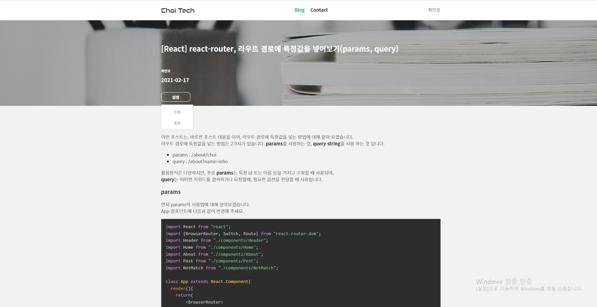

# 프로젝트 소개

이 프로젝트는, 개발하면서 얻은 지식 또는 기술 등을 공유를 하고, 댓글 등을 통하여 서로 질의 응답을 통해 개발자들끼리 양질의 지식을 얻기 위한 블로그 입니다.

---

## 배포 주소

URL: https://c-tech.vercel.app

---

## 프로젝트 환경

### Back-end

- Language & Library: Javascript, Node.js (Express)
- DB: Mysql
- infra: heroku (배포)

백엔드 프로젝트는, 데이터베이스 등 개인 정보 등의 이유로 인하여 코드를 공개 하지 않았습니다.

### Front-end

- Language & Library: Typescript, React (Next.js)
- State: Mobx
- Design: Styled-Components, material-ui, React-modal
- Editor: toast-ui editor, prism, highlight.js
- ETC: React-hook-form, Babel, EsLint, Prettier 등
- infra: Vercel (배포)

---

## 화면 구성

### 1. 메인 화면

> URL : https://c-tech.vercel.app

### 설명

메인 화면에는, 최근에 등록된 게시글에 대해서 3개가 보이도록 구성 되어 있습니다.

또한, 하단에 더보기 버튼을 클릭 했을 경우에, 블로그 링크로 이동 되어, 모든 게시글을 볼 수 있습니다.

### 2. 로그인

> URL : https://c-tech.vercel.app/login

### 설명

이미지와 같이 이메일 및 패스워드를 입력하여, 로그인을 할 수 있습니다. 로그인을 성공하면, 백엔드에서 Response 값으로 JWT Token 값을 전달 해 주는데, 해당 토큰은 쿠키에 저장됩니다.

또한, 해당 페이지에서는, 비밀번호 찾기(Modal) 또는 회원가입 (라우팅)이 되도록 추가되어 있습니다.

비밀번호 찾기는, 앞서 설명과 같이 모달로 동작하도록 구현 되어 있으며, 이메일 유효성 검사 및, 백엔드 쪽에서 인증번호를 생성해서, 등록된 메일로 메일 전송 그리고 인증번호가 일치 할 때 비밀번호를 변경하도록 구현 되어 있습니다.

### 3. 회원가입

> URL : https://c-tech.vercel.app/join

### 설명

회원가입 화면에서는 이메일 형식에 맞게 정규식과 중복 확인을 통한 유효성 검사가 수행 됩니다.

이메일 뿐만 아니라, 특수문자를 포함한 패스워드를 입력하도록 정규식이 구현 되어있습니다.

### 4. 블로그 리스트

> URL: https://c-tech.vercel.app/blog?page=1

### 설명

해당 화면은, 이용자 (개발자 등)들이 등록한 게시글 리스트들을 볼 수 있는 화면 입니다.

주요 기능은, 검색 및 페이지네이션 처리가 되어 있습니다.

#### 추가 기능들

1 ) 페이징

2 ) 글쓴이 메뉴 (특정 글쓴이가 쓴 게시글만 보도록 라우팅 하거나, 메세지를 보낼 수 있는 메뉴)

### 5. 블로그 등록

> URL: https://c-tech.vercel.app/blog/create

### 설명

로그인 후, 게시글을 등록 할 수 있는 화면 입니다.

제목, 요약, 내용, 타입을 입력 할 수 있으며, 내용을 입력하는 부분은 Toast-ui editor library를 사용하여, 마크다운으로 입력 하면, 우측에 html 형식으로 확인 할 수 있습니다.

### 6. 블로그 수정

> URL: https://c-tech.vercel.app/blog/update?blog_id=10

### 설명

화면 구성은 블로그 등록과 동일하게 되어 있습니다.
api 요청은, request header부분에 토큰값을 함께 전달 하여, 서버 쪽에서, 토큰을 검증한 후 본인의 계정일 경우에만 수정 되도록 구현 되어있습니다.

### 7. 블로그 상세

> URL: https://c-tech.vercel.app/blog/1/[id]

### 설명

작성자가 작성한 게시글에 대해 상세 화면으로 진입 합니다.
content는 html 형식으로 된 텍스트로 저장되어 있어, html-react-parser library를 사용하여, 해당 콘텐츠를 텍스트를 html 형식으로 전환 시킵니다.

또한 Prism library를 사용하여, 코드를 block 형식으로 보이도록 구현 되었습니다.

로그인하여 본인의 게시글에 접근 하였을 때, 수정 또는 블로그 숨김 기능을 동작 시킬 수 있습니다.
블로그 숨김기능을 사용하면, 블로그 리스트에서는 볼 수 없습니다. 하지만 마이페이지에서는 숨김 처리된 블로그를 확인 할 수 있으며, 숨김 해제를 통해서 다시 블로그 리스트에 노출 시킬 수 있습니다.

